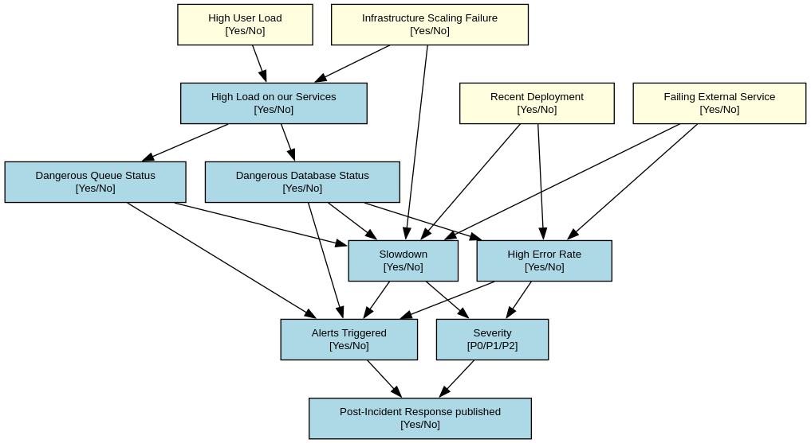

# simplified-bayesian-network-of-production-incident

## Simplified Bayesian Network for Production Incident Analysis 

A probabilistic model to understand causes and risks of incidents in a microservices infrastructure   

As a DevOps/Platform Engineer apprentice in a SAAS company, I frequently observe teams rigging the fire alarm when production alerts trigger. Engineers from Juniors to Manager rush in a call all together to:   

- Understand the problem's nature, impact and scope
- Investigate root causes
     
This inspired me to explore how a Bayesian network could help highlighting probable causes and predict potential consequences  

This repository contains a **very simplified** POC implementation using ~10 key variables.   

## The Bayesian Network structure

the structure was made by myself.

For real case usage, please use a structure learning algorithm to find your bayesian network structure.

## Noisy OR

Because some variables have a lot of parent dependences, we sometime want to put Noisy OR to reduce the network complexity.

In our case, we will add a Noisy OR on both variables : 

- Slowdown
- Alert triggered
- High error rate

Standard CPD for Slowdown with 5 binary parents would be 2^5 = 32 parameters  
With a Noisy-OR it gets reduced to only 6 parameters (5 causes + leak) 

## TODO :

- Find at least 10 variables for the bayesian network : DONE
- Create the network structure using personal knowledge : DONE
- Create and argument the addition of Noisy OR in the bayesian network : DONE
- Create the form to question my colleague for the CPDs of each variables connections in the network
- Ask my Platform and Infra co workers to fill the form 
- (Optional) Randomly remove variables answer in the data and use the Expectation-maximization algorithm to do a probabilistic inference to reconstruct the data. 
- Create the pyagrum implementation to test and show the quality of the model using multiple scenarios.

https://framaforms.org/interrogation-expert-platform-eng-pour-reseau-bayesien-1742933291?info=republished
